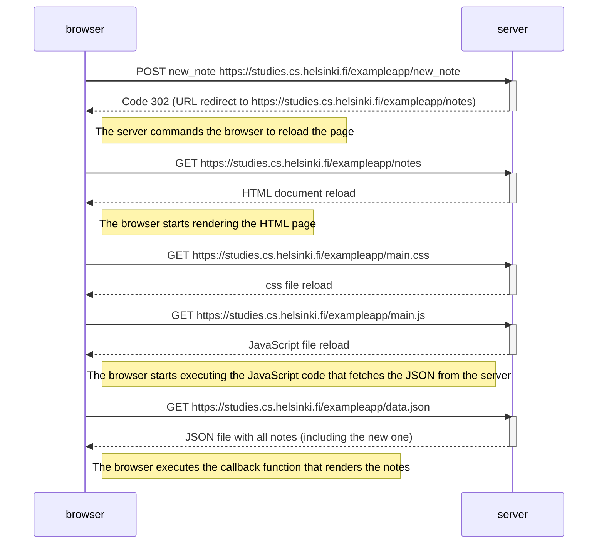

```mermaid
sequenceDiagram
    participant browser
    participant server

    browser->>server: POST new_note https://studies.cs.helsinki.fi/exampleapp/new_note
    activate server
    server-->>browser: Code 302 (URL redirect to https://studies.cs.helsinki.fi/exampleapp/notes)
    deactivate server

    Note right of browser: The server commands the browser to reload the page

    browser->>server: GET https://studies.cs.helsinki.fi/exampleapp/notes
    activate server
    server-->>browser: HTML document reload
    deactivate server

    Note right of browser: The browser starts rendering the HTML page

    browser->>server: GET https://studies.cs.helsinki.fi/exampleapp/main.css
    activate server
    server-->>browser: css file reload
    deactivate server

    browser->>server: GET https://studies.cs.helsinki.fi/exampleapp/main.js
    activate server
    server-->>browser: JavaScript file reload
    deactivate server

    Note right of browser: The browser starts executing the JavaScript code that fetches the JSON from the server

    browser->>server: GET https://studies.cs.helsinki.fi/exampleapp/data.json
    activate server
    server-->>browser: JSON file with all notes (including the new one)
    deactivate server

    Note right of browser: The browser executes the callback function that renders the notes
```